# Guide de Création et Configuration d'une Entreprise

## SAF Logistic — Plateforme SaaS Transport Routier

**URL :** https://saf.dataforgeai.fr

---

## Table des matières

1. [Créer une nouvelle entreprise (Super Admin)](#1-créer-une-nouvelle-entreprise)
2. [Se connecter en tant qu'administrateur de l'entreprise](#2-se-connecter-en-tant-quadministrateur)
3. [Installer les données de référence](#3-installer-les-données-de-référence)
4. [Configurer les paramètres de l'entreprise](#4-configurer-les-paramètres)
5. [Créer les référentiels métier](#5-créer-les-référentiels-métier)
6. [Créer les règles de tarification](#6-créer-les-règles-de-tarification)
7. [Ajouter des utilisateurs](#7-ajouter-des-utilisateurs)
8. [Vérifier que tout est prêt](#8-vérifier-que-tout-est-prêt)

---

## 1. Créer une nouvelle entreprise

> **Qui :** Le Super Administrateur de la plateforme
> **Où :** Menu **Administration** → **Entreprises**

### Étapes :

1. Se connecter avec le compte Super Admin :
   - Email : `admin@saf.local`
   - Mot de passe : `admin`
   - Tenant ID : `00000000-0000-0000-0000-000000000001`

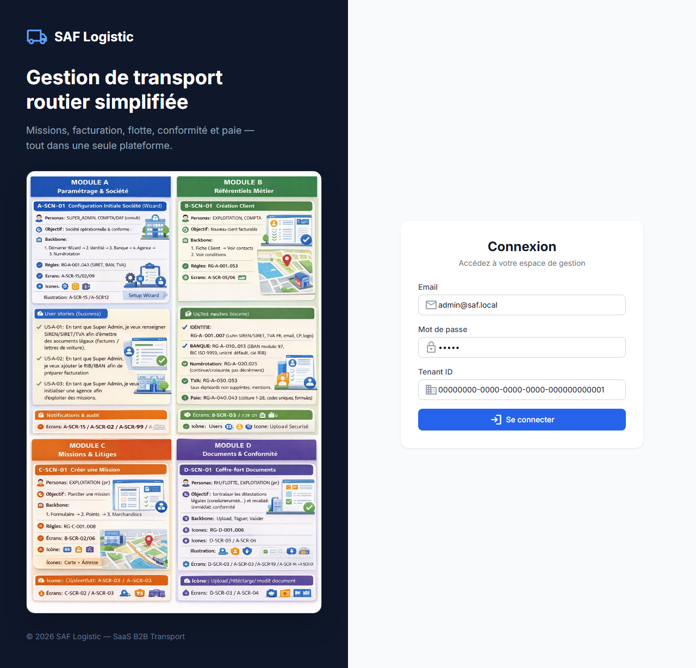

2. Dans le menu latéral, cliquer sur **Administration** → **Entreprises**

3. Cliquer sur **« Créer une entreprise »**

4. Remplir le formulaire :

| Champ | Description | Exemple |
|-------|-------------|---------|
| **Nom de l'entreprise** | Raison sociale | Transport Express SARL |
| **SIREN** | Numéro SIREN (9 chiffres) | 987654321 |
| **Adresse** | Siège social | 10 Rue de la Gare, 69001 Lyon |
| **Nom de l'agence** | Agence par défaut | Agence Lyon |
| **Code agence** | Code court | LYN |
| **Nom complet (admin)** | Nom de l'administrateur | Jean DURAND |
| **Email (admin)** | Email de connexion | admin@transport-express.fr |
| **Mot de passe (admin)** | Minimum 8 caractères | MotDePasse2026! |

5. Cliquer sur **« Créer »**

6. **IMPORTANT — Copier le Tenant ID :**
   - Le Tenant ID apparaît dans la colonne **« Tenant ID »** de la liste
   - Cliquer dessus pour le copier dans le presse-papier
   - **Ce Tenant ID sera nécessaire pour se connecter à l'entreprise**

> **Transmettre au responsable de l'entreprise :**
> - L'URL : https://saf.dataforgeai.fr
> - Le **Tenant ID** (UUID copié)
> - L'**email** et le **mot de passe** de l'administrateur

---

## 2. Se connecter en tant qu'administrateur

> **Qui :** L'administrateur de la nouvelle entreprise
> **Où :** Page de connexion https://saf.dataforgeai.fr/login

### Étapes :

1. Accéder à https://saf.dataforgeai.fr/login

2. Remplir les champs :
   - **Email** : l'email fourni par le Super Admin
   - **Mot de passe** : le mot de passe fourni
   - **Tenant ID** : le UUID fourni (ex: `7c74c775-5c14-4aa1-9ef1-1cce6c5a1fa3`)


3. Cliquer sur **« Se connecter »**

4. Vous arrivez sur la page des Missions (vide pour l'instant)

---

## 3. Installer les données de référence

> **Qui :** L'administrateur de l'entreprise
> **Où :** Menu **Exploitation** → **Configuration**

Cette étape installe automatiquement les données de base françaises nécessaires au fonctionnement de la plateforme.

### Étapes :

1. Dans le menu latéral gauche, ouvrir la section **« Exploitation »**

2. Cliquer sur **« Configuration »**

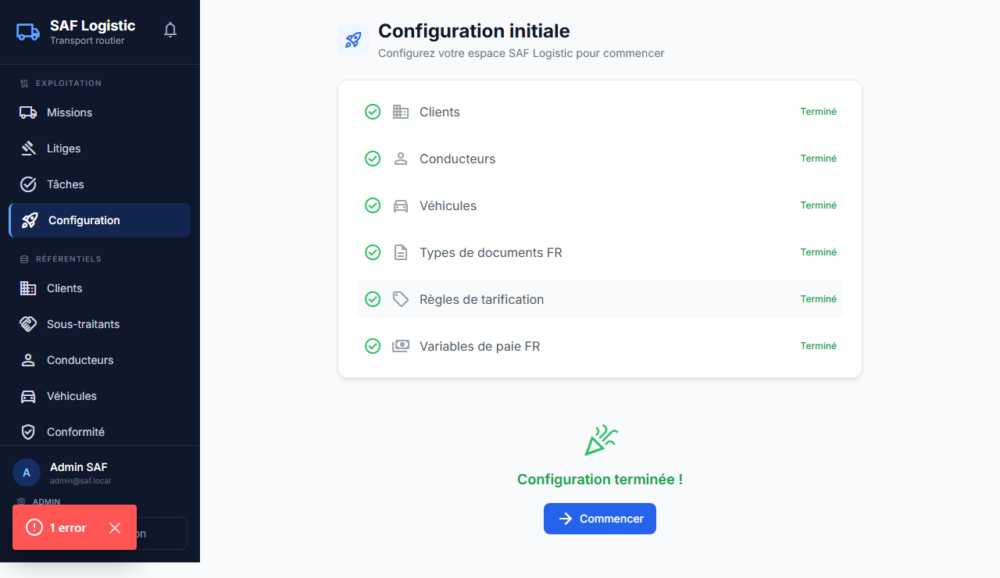

3. La page affiche une checklist de 6 éléments à configurer :
   - ○ Clients
   - ○ Conducteurs
   - ○ Véhicules
   - ○ Types de documents FR
   - ○ Règles de tarification
   - ○ Variables de paie FR

4. Cliquer sur **« Installer les données démo »** dans la section « Démo rapide »

5. Attendre la fin de l'installation (quelques secondes)

### Ce qui est créé automatiquement :

| Catégorie | Données installées |
|-----------|-------------------|
| **Types de documents conducteur** | Permis de conduire, FIMO, FCO, Visite médicale, Carte conducteur, ADR, Carte d'identité |
| **Types de documents véhicule** | Carte grise, Contrôle technique, Assurance, Attestation de capacité |
| **Variables de paie** | Heures normales, HS 25%, HS 50%, Heures nuit, Primes (panier, découché, salissure), Frais km, Indemnités repas, Absences (maladie, CP, RTT) |
| **Taux de TVA** | 20% (normal), 10% (intermédiaire), 5.5% (réduit), 2.1% (super-réduit) |
| **Clients de démo** | Carrefour Supply Chain, Auchan Retail France, Lidl France |
| **Conducteurs de démo** | Jean DUPONT, Marie MARTIN, Pierre BERNARD |
| **Véhicules de démo** | Renault T480, Mercedes Atego, Schmitz Cargobull (frigo) |
| **Sous-traitant de démo** | Transports Martin SARL |

> **Note :** Les données de démo (clients, conducteurs, véhicules) peuvent être modifiées ou supprimées par la suite. Les types de documents et variables de paie sont les standards français et doivent être conservés.

---

## 4. Configurer les paramètres

> **Qui :** L'administrateur de l'entreprise
> **Où :** Menu **Paramétrage** → **Paramètres**

### 4.1 — Informations de l'entreprise

1. Menu latéral → **Paramétrage** → **Paramètres**
2. Onglet **« Entreprise »**

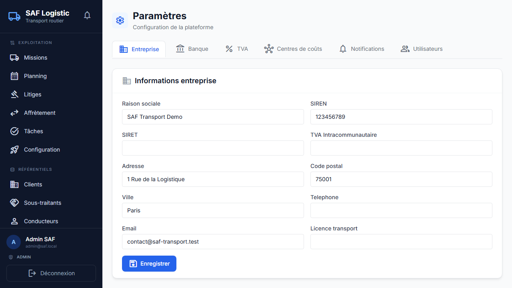

3. Remplir **tous** les champs suivants :

| Champ | Description | Obligatoire |
|-------|-------------|:-----------:|
| **Raison sociale** | Nom légal de l'entreprise | Oui |
| **SIREN** | 9 chiffres | Oui |
| **SIRET** | 14 chiffres (SIREN + NIC) | Oui |
| **TVA Intracommunautaire** | Format FRXX + 9 chiffres | Oui |
| **Adresse** | Adresse complète du siège | Oui |
| **Code postal** | 5 chiffres | Oui |
| **Ville** | Ville du siège | Oui |
| **Téléphone** | Numéro principal | Recommandé |
| **Email** | Email de contact | Recommandé |
| **Licence de transport** | Numéro de licence | Recommandé |

4. Cliquer sur **« Enregistrer »**

### 4.2 — Comptes bancaires

> **Obligatoire pour générer des factures**

1. Onglet **« Banque »**

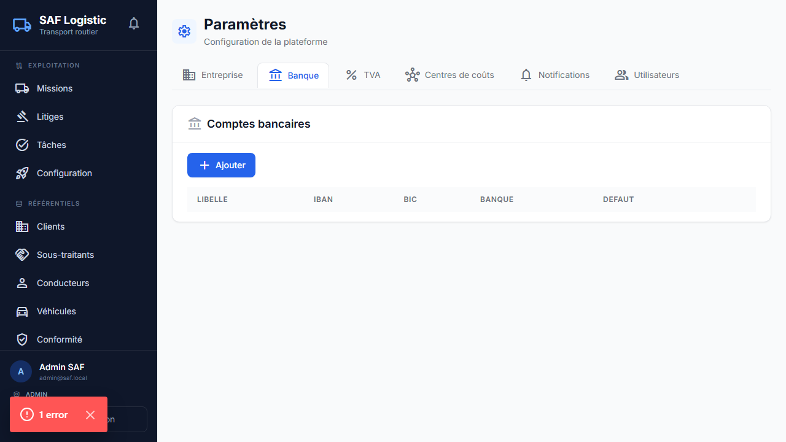

2. Cliquer sur **« Ajouter un compte »**

3. Remplir :

| Champ | Description | Obligatoire |
|-------|-------------|:-----------:|
| **Libellé** | Nom du compte (ex: "Compte principal") | Oui |
| **IBAN** | Code IBAN validé | Oui |
| **BIC** | Code BIC/SWIFT | Recommandé |
| **Banque** | Nom de la banque | Recommandé |
| **Compte par défaut** | Cocher si c'est le compte principal | Recommandé |

4. Cliquer sur **« Enregistrer »**

### 4.3 — Taux de TVA

1. Onglet **« TVA »**

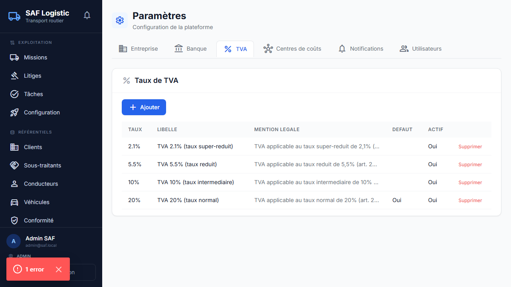

2. Si vous avez installé les données démo, les 4 taux français sont déjà configurés
3. Vérifier que le taux **20%** est marqué comme **« Par défaut »**
4. Modifier ou ajouter des taux si nécessaire

### 4.4 — Centres de coût (optionnel)

1. Onglet **« Centres de coût »**
2. Ajouter vos centres de coût si vous en utilisez (ex: par agence, par activité)

---

## 5. Créer les référentiels métier

> **Qui :** L'administrateur ou l'exploitant
> **Où :** Menu **Référentiels**

Si vous avez installé les données démo, des exemples sont déjà présents. Vous pouvez les modifier ou en ajouter.

### 5.1 — Clients

1. Menu → **Référentiels** → **Clients**

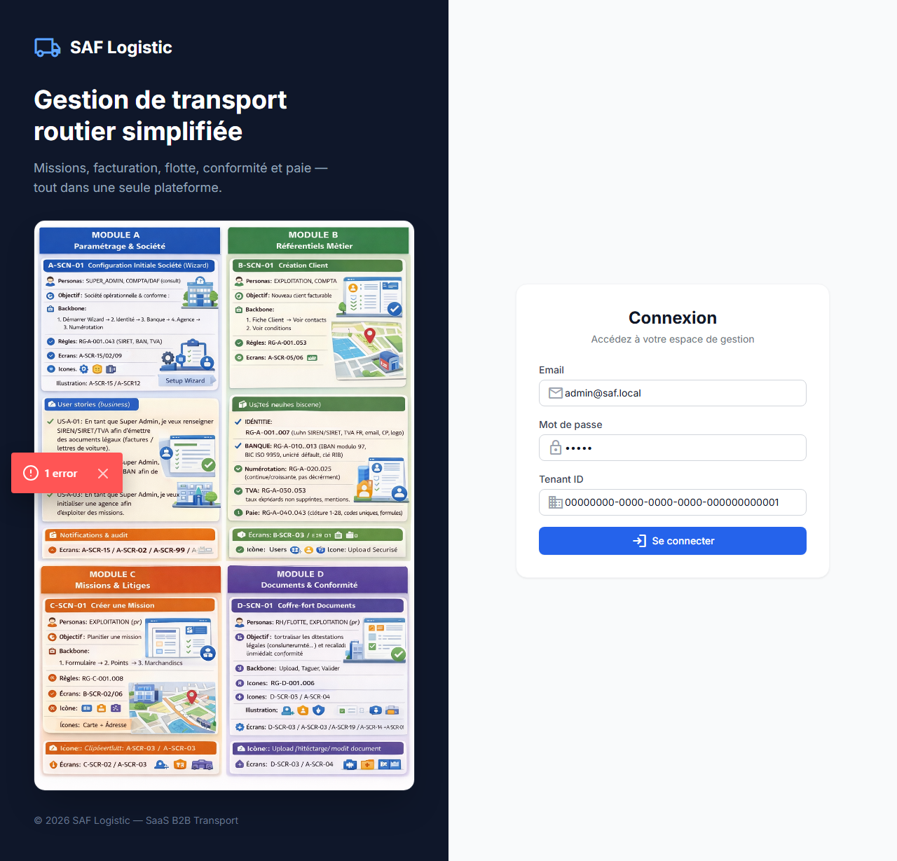

2. Cliquer sur **« Nouveau client »**


3. Remplir les informations :
   - Code client, Raison sociale, SIREN/SIRET
   - Adresse de facturation
   - Contact, email, téléphone
   - **Délai de paiement** (important pour la facturation)
   - Mode de paiement

4. Cliquer sur **« Créer »**

5. Pour voir le détail d'un client, cliquer sur son nom dans la liste

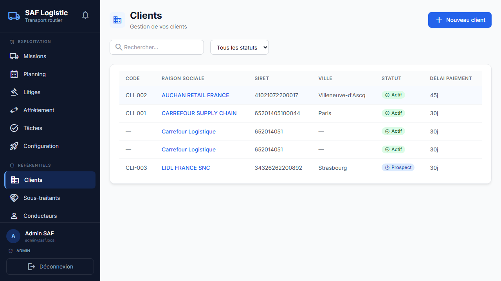

### 5.2 — Conducteurs

1. Menu → **Référentiels** → **Conducteurs**

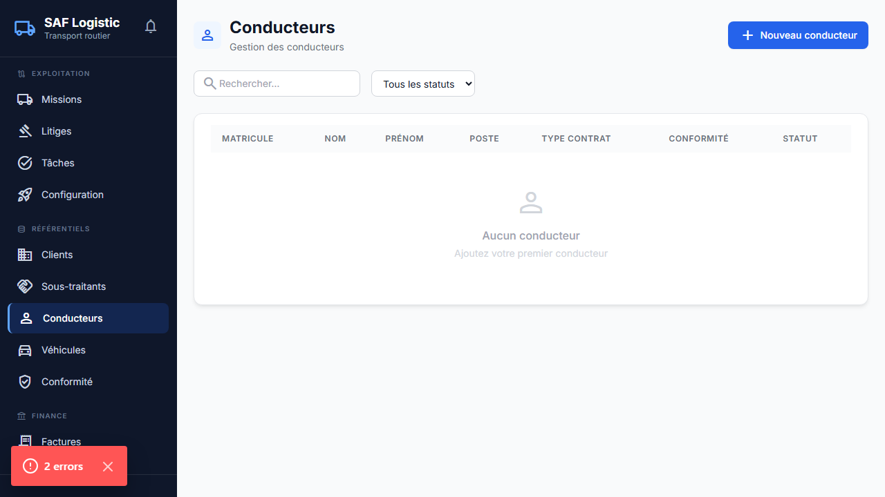

2. Cliquer sur **« Nouveau conducteur »**

3. Remplir :
   - Matricule, Nom, Prénom
   - Date de naissance, Lieu de naissance, Nationalité
   - NIR (numéro de sécurité sociale)
   - Adresse, Téléphone, Email
   - Type de contrat (CDI, CDD...), Date d'entrée
   - Catégories de permis (B, C, CE...)
   - Qualifications (FIMO, FCO, ADR)

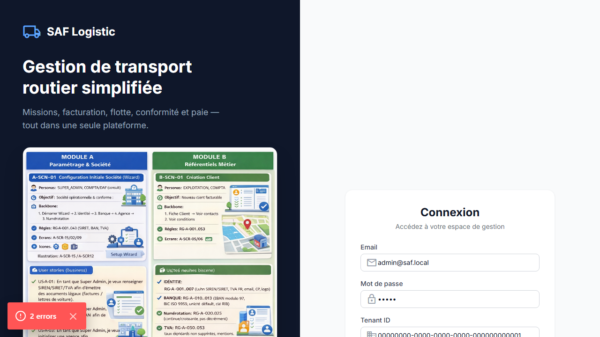

### 5.3 — Véhicules

1. Menu → **Référentiels** → **Véhicules**


2. Cliquer sur **« Nouveau véhicule »**

3. Remplir :
   - Immatriculation, Marque, Modèle
   - Catégorie (PL +19T, SPL, Semi-remorque...)
   - Carrosserie (Bâché, Fourgon, Frigorifique...)
   - PTAC, Charge utile, Volume
   - Norme Euro, Motorisation
   - Propriétaire (Propre, Location...)

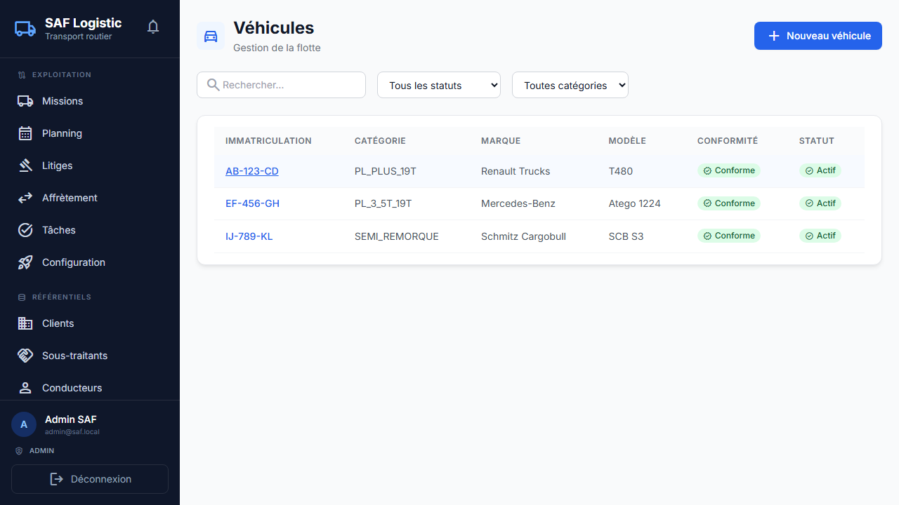

### 5.4 — Sous-traitants (optionnel)

1. Menu → **Référentiels** → **Sous-traitants**


2. Ajouter vos sous-traitants si vous en utilisez

---

## 6. Créer les règles de tarification

> **Qui :** L'administrateur ou le comptable
> **Où :** Menu **Finance** → **Tarifs**

1. Menu → **Finance** → **Tarifs**

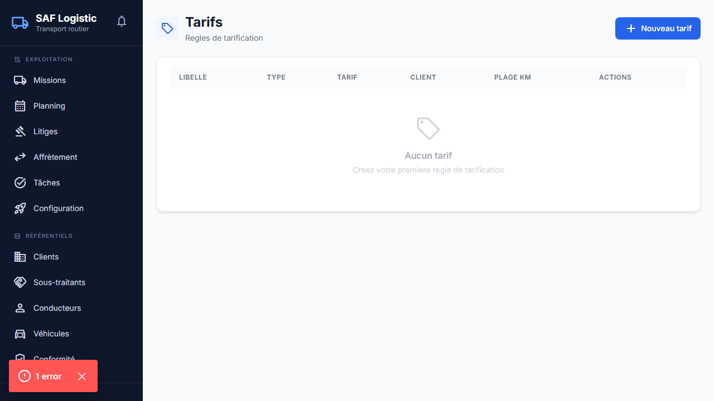

2. Cliquer sur **« Nouveau tarif »**

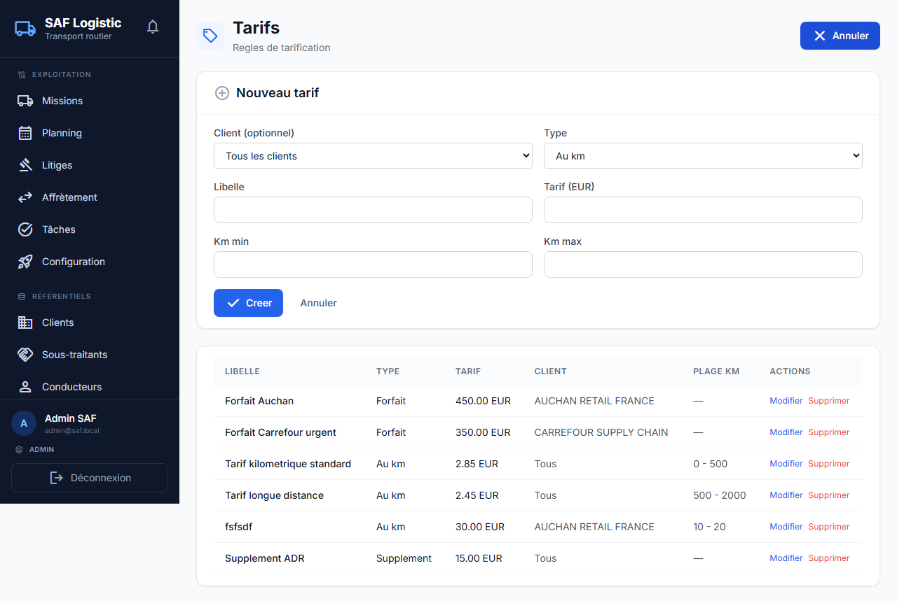

3. Remplir :
   - **Client** : sélectionner le client concerné
   - **Type de tarification** : km, forfait, tonne, palette, heure...
   - **Prix unitaire HT**
   - **Taux de TVA** : sélectionner le taux applicable
   - **Date de début** et **Date de fin** (optionnel)

4. Cliquer sur **« Créer »**

> **Important :** Au moins une règle de tarification est nécessaire pour pouvoir générer des factures.

---

## 7. Ajouter des utilisateurs

> **Qui :** L'administrateur de l'entreprise
> **Où :** Menu **Paramétrage** → **Paramètres** → section Utilisateurs
>
> Ou via l'URL directe : `/admin/tenants` (Super Admin uniquement)

### Rôles disponibles

| Rôle | Accès | Pour qui |
|------|-------|----------|
| **admin** | Accès complet à tous les modules | Dirigeant, Responsable |
| **exploitation** | Missions, planning, litiges, référentiels | Exploitant, Dispatcher |
| **compta** | Factures, avoirs, tarifs, OCR, paie | Comptable |
| **rh_paie** | Paie, conducteurs, documents | Responsable RH |
| **flotte** | Véhicules, maintenance, sinistres | Gestionnaire de flotte |
| **lecture_seule** | Lecture seule sur tous les modules | Auditeur, Consultant |
| **soustraitant** | Missions et documents (lecture) | Partenaire externe |

### Visibilité du menu par rôle

| Section du menu | admin | exploitation | compta | rh_paie | flotte | lecture_seule |
|-----------------|:-----:|:------------:|:------:|:-------:|:------:|:-------------:|
| Exploitation | ✅ | ✅ | ✅ | ✅ | — | ✅ |
| Référentiels | ✅ | ✅ | — | ✅ | ✅ | ✅ |
| Finance | ✅ | — | ✅ | ✅ | — | ✅ |
| Flotte | ✅ | — | — | — | ✅ | ✅ |
| Pilotage | ✅ | — | ✅ | — | — | ✅ |
| Paramétrage | ✅ | — | — | — | — | ✅ |

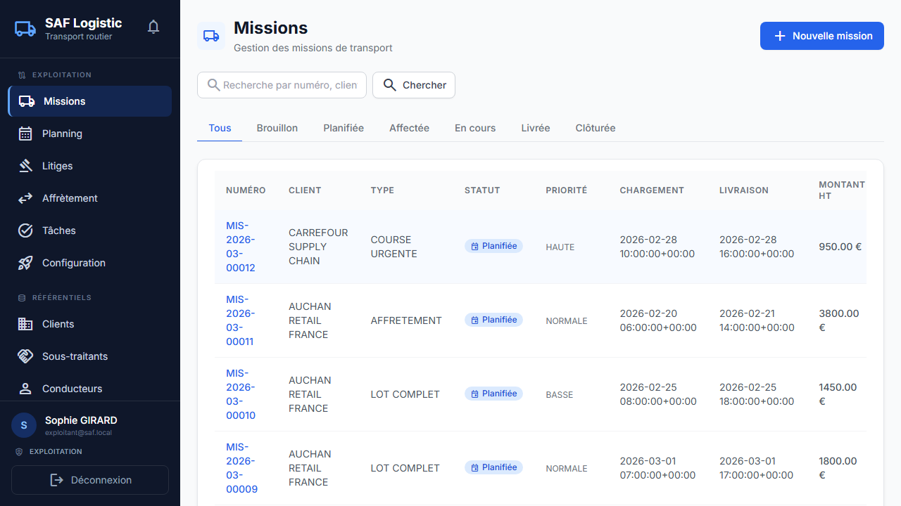
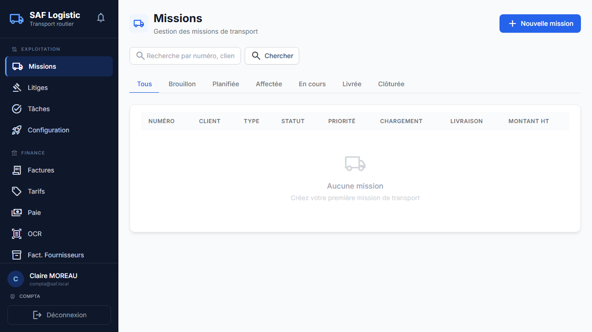
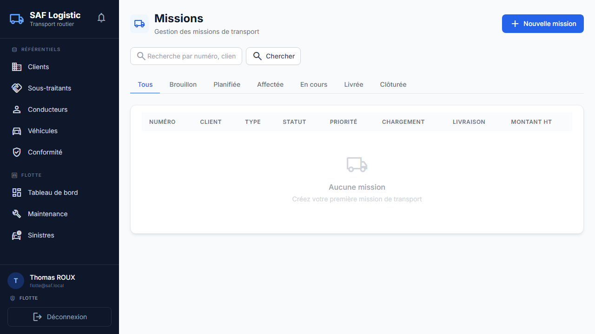

---

## 8. Vérifier que tout est prêt

> **Où :** Menu **Exploitation** → **Configuration**

1. Retourner sur la page **Configuration** (Exploitation → Configuration)

2. Vérifier que les 6 éléments sont cochés en vert :

| Élément | Statut attendu |
|---------|:--------------:|
| Clients | ✅ Terminé |
| Conducteurs | ✅ Terminé |
| Véhicules | ✅ Terminé |
| Types de documents FR | ✅ Terminé |
| Règles de tarification | ✅ Terminé |
| Variables de paie FR | ✅ Terminé |

3. Quand tout est vert, le message **« Configuration terminée ! »** s'affiche

4. Cliquer sur **« Commencer »** pour accéder aux missions

---

## Résumé — Checklist rapide

```
□  1. Super Admin : créer l'entreprise + copier le Tenant ID
□  2. Admin entreprise : se connecter (email + mot de passe + Tenant ID)
□  3. Installer les données démo (Exploitation > Configuration)
□  4. Paramètres > Entreprise : remplir raison sociale, SIREN, SIRET, TVA, adresse
□  5. Paramètres > Banque : ajouter au moins 1 compte bancaire (IBAN)
□  6. Paramètres > TVA : vérifier les taux (déjà installés si démo)
□  7. Référentiels : ajouter/vérifier clients, conducteurs, véhicules
□  8. Finance > Tarifs : créer au moins 1 règle de tarification
□  9. Ajouter les utilisateurs avec les bons rôles
□ 10. Configuration : vérifier que les 6 éléments sont ✅
```

---

## Informations de connexion — Comptes de démo

Si les données démo ont été installées, les comptes suivants sont disponibles **uniquement pour le tenant de démo** (Tenant ID : `00000000-0000-0000-0000-000000000001`) :

| Rôle | Email | Mot de passe |
|------|-------|-------------|
| Super Admin | admin@saf.local | admin |
| Dirigeant | dirigeant@saf.local | dirigeant2026 |
| Exploitant | exploitant@saf.local | exploit2026 |
| Comptable | compta@saf.local | compta2026 |
| RH Paie | rh@saf.local | rh2026 |
| Flotte | flotte@saf.local | flotte2026 |
| Sous-traitant | soustraitant@saf.local | soustraitant2026 |
| Auditeur | auditeur@saf.local | audit2026 |

> **Note :** Pour une nouvelle entreprise créée, seul le compte administrateur existe. Les autres utilisateurs doivent être ajoutés manuellement (voir étape 7).

---

*Document généré le 26/03/2026 — SAF Logistic v1.0*
